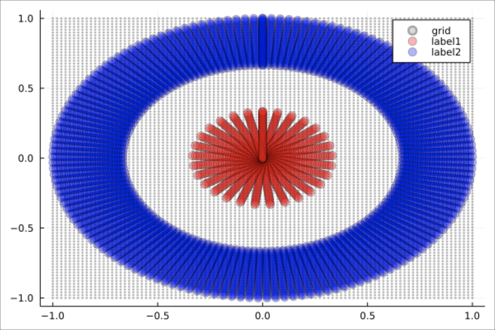
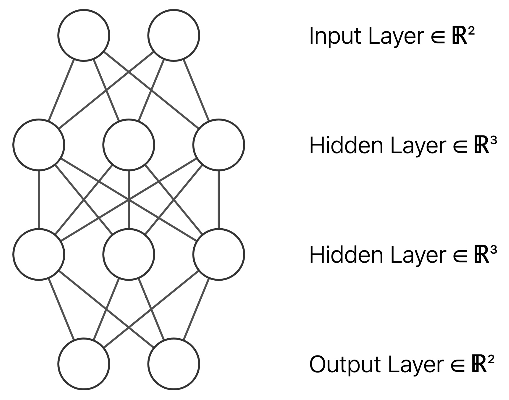
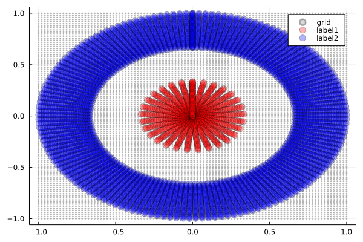

※ 本記事は2022年に書いた記事を更新したものです．少々情報が古いかもしれません．

# はじめに

ニューラルネットワークの内部で何が起きているのか，想像したことはありますか？

私自身も当初は「なんとなく学習している」という程度の理解でしたが，[こちらのQiita記事](https://qiita.com/Soichir0/items/b0b64ffd197c55a6ec54)で紹介されている可視化を拝見し，大きな気づきを得ました．2次元データが3次元空間で変形され，分類される様子が視覚的に示されており，その仕組みがよく理解できました．

この可視化手法をJuliaでも試してみたいと考え，Flux.jlを用いて同様の可視化に挑戦しました．Juliaの数値計算能力とニューラルネットワークの可視化を組み合わせることで，興味深い知見が得られました．

今回は，円環状に配置されたデータを2値分類する問題を通じて，ニューラルネットワークがどのようにデータを変形して分類境界を作り出すのかを可視化します．活性化関数の違いが挙動にどのような影響を与えるのかも，重要なポイントです．

[参考記事：ニューラルネットの挙動を理解する：全結合層と活性化関数による変換 - Qiita](https://qiita.com/Soichir0/items/b0b64ffd197c55a6ec54)

# 問題設定

今回挑戦するのは，線形分離不可能な問題の典型例です．

## データの特徴

下図のように，赤い点（内側の円）と青い点（外側の円環）が同心円状に配置されたデータを用意しました．これは，1本の直線では分離できません．



このようなデータは現実でもよく現れます．例えば：
- **センサーデータの異常検知**：正常値が中央付近，異常値が周辺部に分布
- **顧客セグメンテーション**：コアユーザーとライトユーザーが異なる特徴空間に分布
- **画像認識**：物体の中心部分と背景領域の判別

## ニューラルネットワークの構造

使用するネットワークは以下の構成です：
**2次元入力 → 3次元（活性化関数）→ 3次元（活性化関数）→ 2次元出力 → Softmax**



ポイントは2次元→3次元への拡張です．これにより，2次元では分離不可能だったデータを3次元空間でひねったり折り畳んだりして分離可能にします．これは，紙に描かれた図形を立体的に変形させるようなイメージです．

この変形プロセスを視覚的に確認できる点が，本記事の重要な目的です．

# Julia での実装

Juliaの構文を活かしながら，ステップバイステップで実装していきましょう．

## ステップ1: 必要なパッケージの準備

```julia
using Flux          # ニューラルネットワークのフレームワーク
using LinearAlgebra  # ノルム計算など線形代数の操作
using Plots         # 可視化とGIF生成
using ProgressMeter # 学習進捗の表示
```

Flux.jlは，PyTorchのように直感的に利用できるJuliaのニューラルネットワークフレームワークです．

## ステップ2: 円環状データの生成

まず，分類問題の核となるデータを作成します．

```julia
# 円状に点を作成する関数
circle_coords(r_min, r_max, r_size, θ_size) = [
    r .* (sin(θ), cos(θ))
    for θ in range(0, 2π, length=θ_size)
    for r in range(r_min, r_max, length=r_size)
]

N = 30
x_coords = [
    circle_coords(1e-3, 1/3, N, N),    # 内側の円（赤い点）
    circle_coords(2/3, 1, N, N)        # 外側の円環（青い点）
]

# 座標リストを行列形式に変換
coords2mat(xs) = hcat([[xs[n]...] for n in axes(xs, 1)]...)
x_train = (coords2mat ∘ vcat)(x_coords...)
```

**ここでのポイント**：
- `circle_coords`関数で極座標を使って円状に点を配置しています．
- `1e-3`は原点付近の値を表現しています（厳密な原点では特異点が生じるため）．
- Juliaの関数合成演算子`∘`を用いて関数を合成しています．

## ステップ3: 教師ラベルの作成

```julia
y_train = (coords2mat ∘ vcat)(
    [(1, 0) for _ in 1:N^2],  # 内側の円: クラス1
    [(0, 1) for _ in 1:N^2]   # 外側の円: クラス2
);
data = [(x_train, y_train)]
```

One-hotエンコーディングにより，内側のデータには`[1,0]`，外側のデータには`[0,1]`のラベルを付与しています．

## ステップ4: ニューラルネットワークの構築と学習

```julia
# ネットワークの定義
model = Chain(
    Dense(2 => 3),          # 2次元→3次元への拡張
    Dense(3 => 3, relu),    # 3次元での第1変換
    Dense(3 => 3, relu),    # 3次元での第2変換  
    Dense(3 => 2),          # 3次元→2次元への縮約
    softmax                 # 最終的な分類確率
)

# 学習の実行
epoch_num = 50_000
params = Flux.params(model)
regular_rate = 0.01
loss(x, y) = Flux.crossentropy(model(x), y) + regular_rate * norm(params)
opt = Descent()

@showprogress "Epoch of training: " for epoch in 1:epoch_num
    Flux.train!(loss, params, data, opt)
end
```

**学習におけるポイント**：
- **正則化項**（`regular_rate * \norm{params}`）を導入することで，過学習を抑制します．
- **50,000エポック**と多めに設定していますが，このような可視化においては安定した収束が重要となります．
- `@showprogress`を使用することで進捗バーが表示され，長時間の学習でも状況を把握しやすくなります．

## ステップ5: 可視化用の格子点生成

背景の空間の歪みを見るために，格子状の点群を用意します．

```julia
function grid_coords(x_coords)
    x_mat = coords2mat(x_coords)
    x₁_min, x₁_max = round.([minimum(x_mat[1, :]), maximum(x_mat[1, :])])
    x₂_min, x₂_max = round.([minimum(x_mat[2, :]), maximum(x_mat[2, :])])
    [
        Float64.((i, j))
        for i in range(x₁_min, x₁_max, length=100)
        for j in range(x₂_min, x₂_max, length=100)
    ]
end
```

これらのグレーの点が各層でどのように変形されるかを観察することで，ニューラルネットワークによる空間変換の様子を詳細に理解できます．

## ステップ6: アニメーション生成の仕組み

本セクションでは，アニメーション生成の技術的な仕組みについて解説します．

```julia
# 隣接フレーム間の線形補間
insert_lerp(xs) =
    let xs_lerp = [
            [
                (xs[n][i] .+ xs[n+1][i]) ./ 2
                for i in axes(xs[n], 1)
            ]
            for n in axes(xs, 1)[1:end-1]
        ]
        [
            n % 2 == 0 ? xs_lerp[div(n, 2)] : xs[div(n, 2)+1]
            for n in 1:2size(xs, 1)-1
        ]
    end

# 各層の出力を順次記録してフレーム生成
function create_frames(x_coords, log2_expansion_rate=6)
    x_mat = coords2mat(x_coords)
    anim_x = [x_coords]
    
    for layer_depth in 1:length(model)
        # 各層の出力（最初の2次元のみ使用）
        y = model[1:layer_depth](x_mat)[1:2, :]
        y_coords = mat2coords(y)
        anim_x = [anim_x..., y_coords]
    end
    
    # 補間でなめらかなアニメーションを生成
    foldl(∘, repeat([insert_lerp], log2_expansion_rate))(anim_x)
end
```

**技術的なポイント**：
- `model[1:layer_depth]`で第$k$層までの部分ネットワークを抽出しています．
- `[1:2, :]`で3次元出力の最初の2次元だけを可視化に使用しています．
- `log2_expansion_rate=6`により，$2^6=64$倍のフレーム数に拡張し，滑らかなアニメーションを実現しています．

## ステップ7: 最終的なGIF生成

```julia
# データ点のアニメーション準備
x_plot = [
    circle_coords(1e-3, 1/3, N, N),
    circle_coords(2/3, 1, N, 5N)  # 外側は点数を増やして見栄え向上
]
anim_xplot = create_frames.(x_plot)

# 格子点のアニメーション準備
anim_xgrid = (create_frames ∘ grid_coords ∘ vcat)(x_plot...)

# プロット実行
anim_plots = zip(anim_xplot..., anim_xgrid)
gif_prog = Progress(length(anim_plots), desc="Render GIF: ")

@gif for (x₁, x₂, xgrid) in anim_plots
    plot()
    plot!(xgrid, seriestype=:scatter, mc=:gray, ma=0.3, ms=2, label="grid")
    plot!(x₁, seriestype=:scatter, mc=:red, ma=0.3, ms=6, label="label1")
    plot!(x₂, seriestype=:scatter, mc=:blue, ma=0.3, ms=6, label="label2")
    next!(gif_prog)
end
```

`@gif`マクロにより，ループの各反復が自動的にGIFのフレームになります．Juliaの表現力の高さが感じられる点です．

## ソースコード全体

```julia
using Flux
using LinearAlgebra
using Plots
using ProgressMeter

coords2mat(xs) = hcat([[xs[n]...,] for n in axes(xs, 1)]...)
mat2coords(xs) = [(xs[:, j]...,) for j in axes(xs, 2)]

insert_lerp(xs) =
    let xs_lerp = [
            [
                (xs[n][i] .+ xs[n+1][i]) ./ 2
                for i in axes(xs[n], 1)
            ]
            for n in axes(xs, 1)[1:end-1]
        ]
        [
            n % 2 == 0 ? xs_lerp[div(n, 2)] : xs[div(n, 2)+1]
            for n in 1:2size(xs, 1)-1
        ]
    end

function create_frames(x_coords, log2_expansion_rate=6)
    x_mat = coords2mat(x_coords)
    anim_x = [x_coords]
    for layer_depth in 1:length(model)
        y = model[1:layer_depth](x_mat)[1:2, :]
        y_coords = mat2coords(y)
        anim_x = [anim_x..., y_coords]
    end
    foldl(∘, repeat([insert_lerp], log2_expansion_rate))(anim_x)
end

# 格子点を作成
function grid_coords(x_coords)
    x_mat = coords2mat(x_coords)
    x₁_min, x₁_max = round.([minimum(x_mat[1, :]), maximum(x_mat[1, :])])
    x₂_min, x₂_max = round.([minimum(x_mat[2, :]), maximum(x_mat[2, :])])
    [
        Float64.((i, j))
        for i in range(x₁_min, x₁_max, length=100)
        for j in range(x₂_min, x₂_max, length=100)
    ]
end

# 円状に点を作成
circle_coords(r_min, r_max, r_size, θ_size) = [
    r .* (sin(θ), cos(θ))
    for θ in range(0, 2π, length=θ_size)
    for r in range(r_min, r_max, length=r_size)
]

# 訓練データの作詞
N = 30
x_coords = [
    circle_coords(1e-3, 1 / 3, N, N),
    circle_coords(2 / 3, 1, N, N)
]
x_train = (coords2mat ∘ vcat)(x_coords...);
y_train = (coords2mat ∘ vcat)(
    [(1, 0) for _ in 1:N^2],
    [(0, 1) for _ in 1:N^2]
);
data = [(x_train, y_train)];

# 訓練対象のモデル作成
model = Chain(
    Dense(2 => 3),
    Dense(3 => 3, relu),
    Dense(3 => 3, relu),
    Dense(3 => 2),
    softmax
)

# モデルの学習
epoch_num = 50_000;
params = Flux.params(model);
regular_rate = 0.01;
loss(x, y) = Flux.crossentropy(model(x), y) + regular_rate * norm(params);
opt = Descent()

@showprogress "Epoch of training: " for epoch in 1:epoch_num
    Flux.train!(loss, params, data, opt)
end

# 訓練結果のブロット
x_plot = [
    circle_coords(1e-3, 1 / 3, N, N),
    circle_coords(2 / 3, 1, N, 5N)
];
anim_xplot = create_frames.(x_plot);
anim_xgrid = (create_frames ∘ grid_coords ∘ vcat)(x_plot...);
anim_plots = zip(anim_xplot..., anim_xgrid);
gif_prog = Progress(length(anim_plots), desc="Render GIF: ");
@gif for (x₁, x₂, xgrid) in anim_plots
    plot()
    plot!(xgrid, seriestype=:scatter, mc=:gray, ma=0.3, ms=2, label="grid")
    plot!(x₁, seriestype=:scatter, mc=:red, ma=0.3, ms=6, label="label1")
    plot!(x₂, seriestype=:scatter, mc=:blue, ma=0.3, ms=6, label="label2")
    next!(gif_prog)
end
```

# 実行結果：活性化関数による空間変換

それでは，可視化の結果を見ていきましょう．各活性化関数がどのような空間変換を用いて分類を実現するのかを考察します．
ネットワーク構造は **2次元入力 → 3次元（活性化関数）→ 3次元（活性化関数）→ 2次元出力 → Softmax** です．

## Tanh を使った場合

Tanh関数（双曲線正接）の特徴は，滑らかで対称的な$S$字カーブです．


**観察ポイント**：
- **滑らかな変形**：データポイントが連続的に，まるでゴムシートを引っ張るように変形します．
- **対称性の保持**：Tanhの対称性により，変形も比較的対称的です．
- **境界の創出**：3次元空間での「ひねり」により，2次元では不可能だった分離境界を実現します．

この動きは，空間を滑らかに変形させる様子を示しており，興味深い点です．

## ReLU を使った場合

ReLU（Rectified Linear Unit）は，負の値を$0$に設定する単純な関数です．



**観察ポイント**：
- **鋭い折り畳み**：ReLUの線形性により，空間が直線的に折り畳まれる様子が確認できます．
- **区分線形変換**：各領域で線形変換が組み合わさった結果の複雑な変形が生じます．
- **効率的な分離**：シンプルな機構でも十分に分離境界を作成可能です．

これは，折り紙のように空間に明確な折り目を付けて再構成する，効率的なアプローチと言えます．

## GeLU を使った場合

GeLU（Gaussian Error Linear Unit）は，ReLUの滑らかな改良版として注目される新しい活性化関数です．


**観察ポイント**：
- **滑らかな折り畳み**：ReLUの鋭角性を保ちつつ，Tanhのような滑らかさも実現しています．
- **グラデーション効果**：変形の境界がソフトで，より自然な変化を示します．
- **最適化の利点**：勾配の連続性により学習が安定します（この可視化でも確認可能です）．

GeLUは，ReLUの特性とTanhの滑らかさを兼ね備えた現代的なアプローチと言えます．

## 活性化関数比較まとめ

| 活性化関数 | 変形の特徴     | 計算効率 | 学習安定性 | 視覚的印象     |
| ---------- | -------------- | -------- | ---------- | -------------- |
| **Tanh**   | 滑らかで対称的 | 中程度   | 良い       | しなやかな曲線 |
| **ReLU**   | 鋭角で効率的   | 高い     | 良い       | 鋭い折り畳み   |
| **GeLU**   | 滑らかで現代的 | 中程度   | 優秀       | 優雅な統合     |

## 可視化から学べること

この可視化から，以下の重要な洞察が得られます．

1. **次元拡張の威力**：2次元から3次元への拡張により，線形分離不可能なデータを分離可能にします．
2. **活性化関数の個性**：同じ問題でも，活性化関数により全く異なる解法が採用されます．
3. **非線形変換の仕組み**：数式では理解しづらい変換を視覚的に体感できます．
4. **深層学習の理解**：「なぜうまくいくのか」がよくわかります．

まさに「百聞は一見に如かず」という言葉が当てはまる結果です．

# まとめ：「見える」ことで「わかる」世界

Juliaを用いたニューラルネットワークの可視化は，その内部動作を理解する上で非常に有効な手段です．
ニューラルネットワークは，もはやブラックボックスではありません．適切な可視化を通じて，その内部で生じる数学的な変換を視覚的に捉えることが可能となります．

---

**関連リンク**：
- [Julia公式サイト](https://julialang.org/)
- [Flux.jl公式ドキュメント](https://fluxml.ai/Flux.jl/stable/)
- [参考記事：ニューラルネットの挙動を理解する](https://qiita.com/Soichir0/items/b0b64ffd197c55a6ec54)
